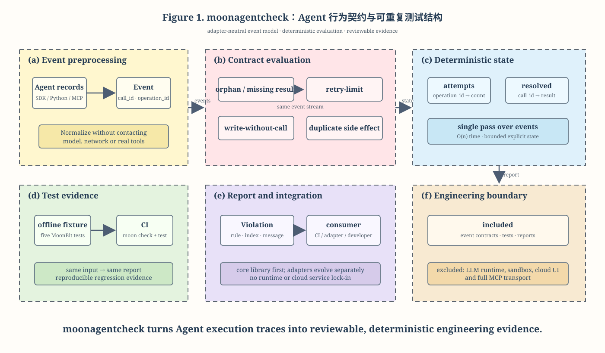
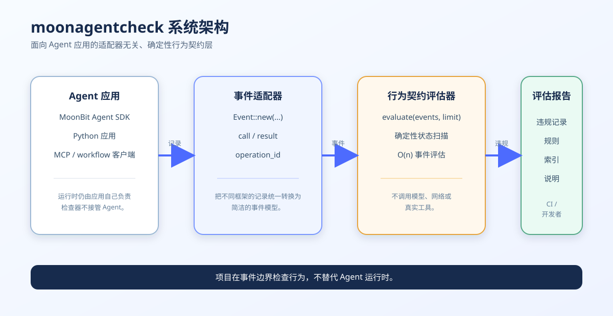
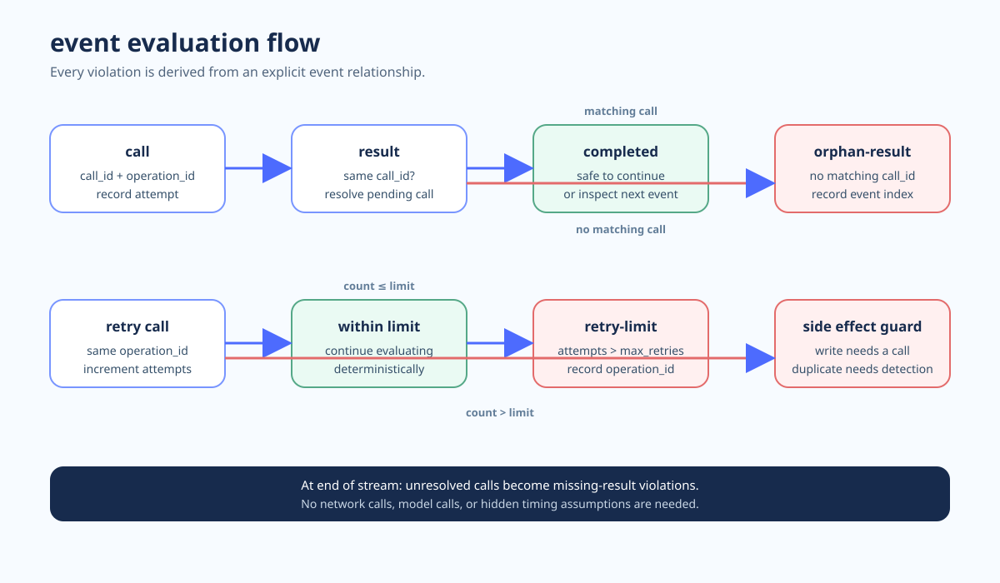
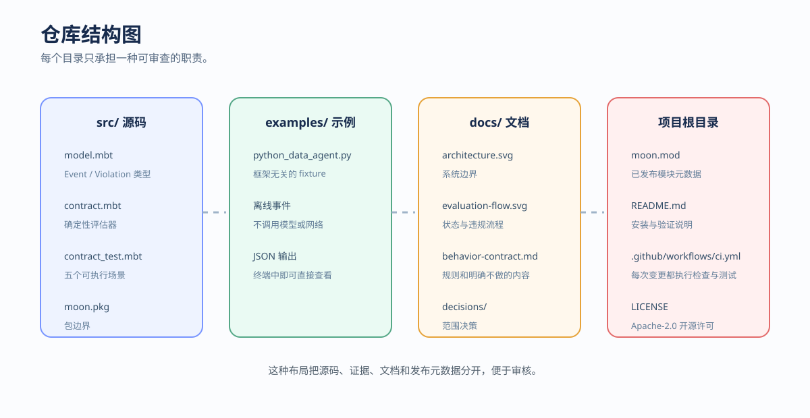

# moonagentcheck

给 agent 的工具行为写可重复测试。

moonagentcheck 计划提供一个 MoonBit 核心库：把 agent 的工具调用记录规范化为事件流，用行为契约检查调用与结果是否配对、是否满足资源前置条件、是否超过重试上限、是否发生重复副作用。测试使用受控 fixture，不访问真实服务；结果可输出为人类可读文本或 JSON，便于放进 CI。

## 项目结构图









## 当前状态

这是 2026 年 9 月 MoonBit 黑客松的开发中项目。当前版本已交付可发布的 MoonBit 核心库、Python 对照实现、离线 fixture 和 CI 检查。

## 核心 API

`Event::new(kind, tool, call_id, operation_id, ok)` 创建一条适配器事件；`evaluate(events, max_retries)` 返回按事件顺序排列的 `Violation`。当前检查规则包括：

- `orphan-result`：结果没有对应调用。
- `missing-result`：调用结束时没有结果。
- `retry-limit`：逻辑操作超过重试上限。
- `duplicate-side-effect`：同一逻辑写操作完成两次。
- `write-without-call`：写入完成事件没有对应调用。
- `duplicate-call-id`：事件流复用了调用 ID。

所有检查都是确定性的，不会访问模型、网络或真实文件系统，适合放进 agent 的离线回归测试。

## 本地验证

```powershell
moon check
moon test
python examples/python_data_agent.py
```

## 计划中的三个场景

1. 数据处理 agent：工具返回缺失列错误时，测试 agent 是否把错误误当成成功。
2. 仓库助手：没有先读取目标文件，或没有获得对应授权时，测试是否阻止写入完成事件。
3. 工单处理 agent：暂时错误触发重试时，测试重试上限和重复写回。

## 快速试用 Python 参考实现

```powershell
python examples/python_data_agent.py
```

参考实现只用于验证事件模型和场景，不替代 MoonBit 核心。它不连接模型、网络或真实文件系统。

## MoonBit 计划接口

当前稳定概念是 `Event`、`Violation` 和 `evaluate`。`Contract`、`RunReport` 和 CLI 会在事件格式和实际适配器案例稳定后继续演进。

## 边界

首版不实现 LLM 推理、操作系统沙箱、完整 MCP 传输、云端工作台或通用 JSON Schema 解析器。行为检查验证观察到的事件，不提供实时安全隔离。

## 许可证

Apache-2.0，见 [LICENSE](LICENSE)。
